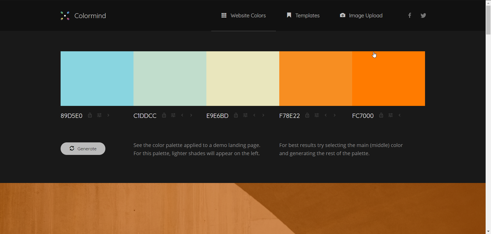

#  Introduccion a CSS LMSGI-02

Basandome en el trabajo [anterior](https://github.com/v4nnig/lmsgi_tema02_html) he procedido a crear los estilos CSS para esté documento.

Para lo cual he intentado utilizar lo máximo que me ha sido posible de CSS3 y las etiquetas semanticas de HTML5.

En el comienzo del archivo [CSS](css/style.css) detallo la paleta de colores utilizada, con la declaración de un falso elemento para que podáis visualizar los colores con un editor que cuente con previsualización de colores como por ejemplo [Visual Studio Code](https://code.visualstudio.com/).

*Con la herramienta [Colormind](http://colormind.io/bootstrap/) ilustro la paleta que he usado.*


## Estilos de la tabla CSS
Respecto a la tabla de la página, he utilizado un selector de CSS3 que permite dar estilo a los hijos seleciónados según su lugar en el flujo.

```CSS
#terceraparte th:nth-child(1) {
    background-color: #c1ddcc;
}

#terceraparte th:nth-child(2) {
    background-color: #f78e22;
}
```
La validación del documento se puede verificar en [validator.w3.org](https://validator.w3.org/nu/?doc=https://rawgit.com/v4nnig/lmsgi_tema02_html/master/index.html) y el documento puede verse directamente desde [rawgit](https://rawgit.com/v4nnig/lmsgi_tema02_html/master/index.html).


